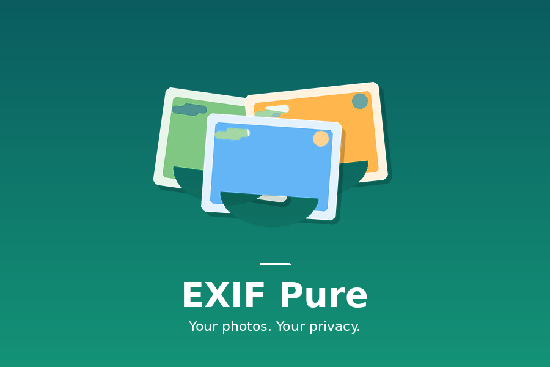

# EXIF Pure

> **Your photos. Your privacy.**

A local-only, zero-permission-excess photo organizer for Android. Browse your gallery, inspect EXIF metadata, and export clean copies with all identifying data stripped; without ever sending a single byte to the cloud.



---

## Privacy Manifesto

- **No accounts.** No email, no phone number, no signup.
- **No network calls.** The app never connects to the internet.
- **No ads or trackers.** No Firebase, no analytics, no crash reporters.
- **Local-only processing.** All EXIF stripping happens on your device.
- **Originals untouched.** Export creates a new file; your source image is never modified.

---

## Features

| Feature | Description |
|---------|-------------|
| **Gallery Browser** | Browse all device photos via MediaStore. Scoped-storage compliant on Android 10+. |
| **EXIF Inspector** | View camera make/model, lens, exposure, ISO, focal length, GPS coordinates, and orientation. |
| **Lossless Metadata Stripper** | JPEG and PNG are rewritten segment-by-segment with zero re-compression. WEBP/HEIF fall back to high-quality re-encode. |
| **Strip Modes** | `All Metadata` removes everything. `GPS Only` removes only location data while preserving camera info. |
| **Batch Export** | Select multiple photos and share clean copies in one action. |
| **Favorites & Search** | Star photos, filter by favorites, search by filename or album name. |
| **Sort & Grid** | Sort by date, name, or size. Toggle small/medium/large grid density. |
| **Biometric Lock** | Require fingerprint or face unlock to open the app. Re-locks automatically when backgrounded. |
| **Encrypted Preferences** | Settings and favorites stored with AES-256 SIV/GCM via `EncryptedSharedPreferences`. |
| **Export History** | Log of every clean copy exported, with timestamp and strip mode. |
| **Edge-to-Edge UI** | Material 3 design with full edge-to-edge layout and dynamic color support on Android 12+. |

---

## Architecture

| Layer | Choice | Rationale |
|-------|--------|-----------|
| **UI** | Jetpack Compose + Material 3 | Single Activity, declarative, edge-to-edge |
| **DI** | Manual `AppContainer` | Zero annotation processing overhead; compile-time safety |
| **State** | `StateFlow` + ViewModel | Lifecycle-aware, testable, no external MVI lib |
| **Images** | Coil | Lightweight; loads from `content://` URIs without network deps |
| **EXIF** | `ExifInterface` (AndroidX) + Custom Stripper | Reads via framework; strips via custom lossless JPEG/PNG parser (zero native deps) |
| **Prefs** | `EncryptedSharedPreferences` | `security-crypto` minSdk=23; AES-256 SIV/GCM |
| **Storage** | MediaStore API | Scoped-storage compliant on API 29+; legacy path support on API 23-28 |

---

## Permissions

| Permission | Usage |
|------------|-------|
| `READ_MEDIA_IMAGES` (Android 13+) | Read photos from device storage |
| `READ_MEDIA_VISUAL_USER_SELECTED` (Android 14+) | Partial photo access support |
| `READ_EXTERNAL_STORAGE` (Android 12 and below) | Legacy storage read access |
| Biometric hardware | Optional; used only if app lock is enabled in Settings |

---

## Installation

### Manual APK

Download the latest APK from the [Releases](https://github.com/x144k/ExifPure/releases) page.

**Verify the APK:**
```bash
sha256sum app-release.apk
```
Compare the output against the SHA-256 listed in the release notes.

**Install via ADB:**
```bash
adb install app-release.apk
```

### Obtainium

Add EXIF Pure to [Obtainium](https://github.com/ImranR98/Obtainium) for automatic updates directly from GitHub releases.

1. Install Obtainium from its [releases page](https://github.com/ImranR98/Obtainium/releases).
2. Open Obtainium; tap **Add App**.
3. Paste the repository URL: `https://github.com/x144k/ExifPure`
4. Obtainium will auto-detect GitHub releases and pull the latest APK; tap **Add** to track it.
5. Future updates appear in Obtainium as soon as a new release is published.

If auto-detection fails, use the fallback URL: `https://github.com/x144k/ExifPure/releases`

---

## Building from Source

```bash
git clone https://github.com/x144k/ExifPure.git
cd ExifPure
./gradlew :app:assembleDebug
adb install app/build/outputs/apk/debug/app-debug.apk
```

For a signed release build:
```bash
./gradlew :app:assembleRelease
```

---

## Upcoming Features

- [x] **Folder/album view**; group photos by bucket/album instead of a flat grid.
- [x] **Dark theme enforcement**; force dark mode independently of system setting.
- [ ] **Widget**; home screen widget showing a random favorite photo.
- [ ] **Duplicate detection**; find visually similar or exact-duplicate photos to help clean up storage.
- [ ] **Auto-export on share**; intercept system share intents to automatically strip metadata when sharing from other apps.
- [ ] **In-app EXIF editor**; modify specific fields (e.g., add copyright, correct date) instead of only stripping.
- [ ] **HEIC/HEIF lossless stripping**; extend the custom segment parser to handle HEIC containers without bitmap re-encode. Experimental; may require HEVC NAL scanning for embedded SEI metadata.

---

## Contributing

Contributions are welcome. Please open an issue first to discuss significant changes.

1. Fork the repository
2. Create a feature branch (`git checkout -b feature/amazing-feature`)
3. Commit your changes (`git commit -m 'Add amazing feature'`)
4. Push to the branch (`git push origin feature/amazing-feature`)
5. Open a Pull Request

---

## License

MIT License; see [LICENSE](LICENSE) for details.

---

*EXIF Pure is not affiliated with Google, Samsung, or any camera manufacturer. All trademarks belong to their respective owners.*
